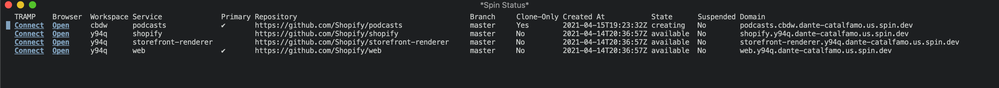

# spin.el

[Emacs](https://www.gnu.org/software/emacs/) integration for [spin](https://github.com/Shopify/spin).

## Commands

- `spin-status` Displays the spin status buffer. Displays all current spin VMs.

## Keybinds 

- `?` Display the spacial options for the buffer. Similar `magit`
- `c` Spin create options
- `d` Spin destroy options
- `t` Spin try options
- `v` Spin VPN options

## Demo
https://videobin.shopify.io/v/vjPPV
Note: A lot of the commands and options have changed since this was filmed
